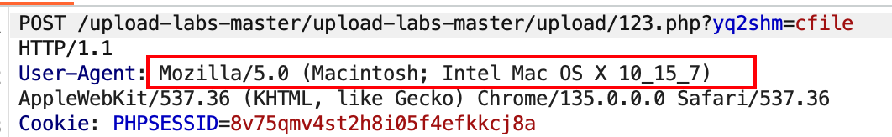
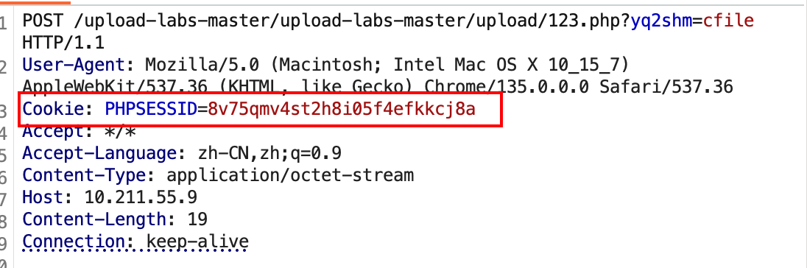
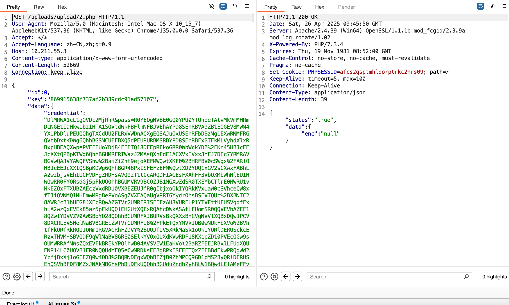
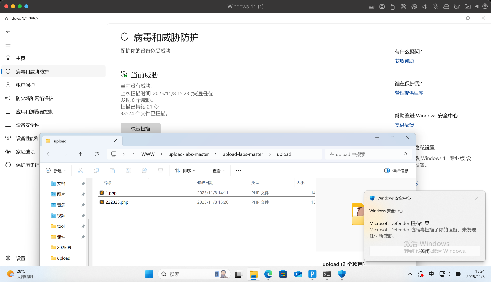
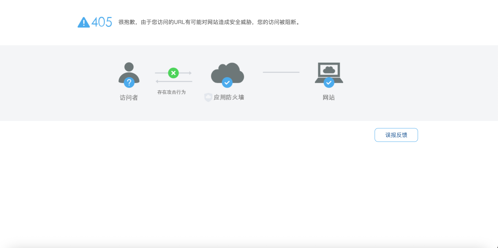
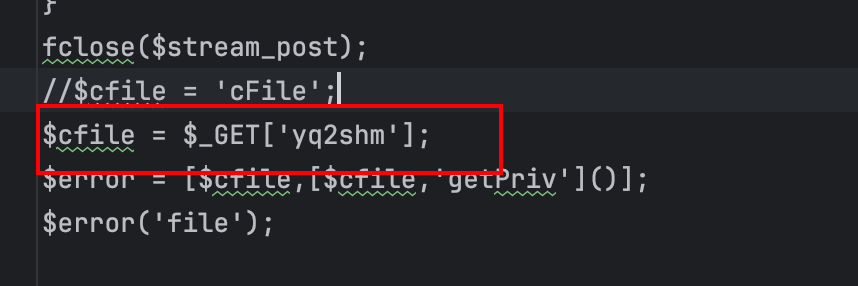
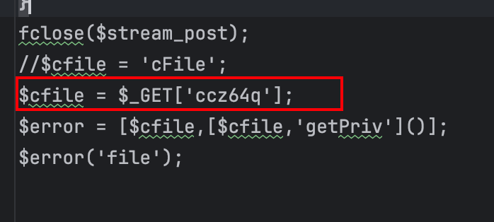
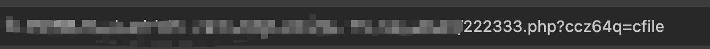

## 记录一下自己魔改的哥斯拉

直接下载jar包运行即可

1. 将User-Agent进行了修改 不再是默认的user-agent
   
2. 将cookie后面的一个分号特征给去除了
   
3. 将一句话木马的连接传输方式修改成json格式
   
4. 添加了两个简单的php免杀木马
   

并且访问页面是405的

需要添加上特定的参数才能访问到webshell

其他的魔改还在学习，后续还会更新